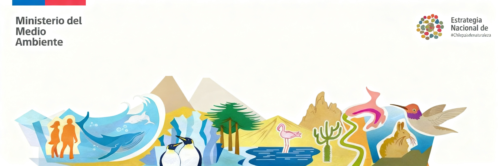
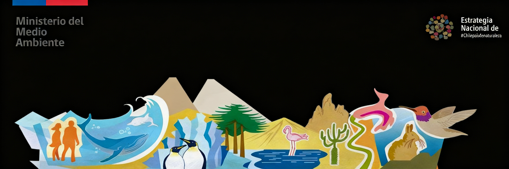

<h1 class="myst-fm-block-title mb-0">Sistema de seguimiento y monitoreo de la Estrategia Nacional de Biodiversidad (ENB)</h1>

  
  

La plataforma del sistema de seguimiento y monitoreo de la Estrategia Nacional de Biodiversidad constituye una infraestructura integrada para la gestión, análisis y reporte de información, orientada a evaluar el progreso hacia las metas nacionales en coherencia con el Marco Global de Biodiversidad. Su propósito es transformar datos provenientes de múltiples fuentes oficiales en indicadores trazables y comparables, fortaleciendo la toma de decisiones basada en evidencia, transparencia de la información y el reporte de avances en la implementación de la estrategia.

---

<table>
  <thead>
    <tr>
      <th>Objetivo</th>
      <th>Meta</th>
      <th>Indicadores</th>
    </tr>
  </thead>
  <tbody>
    <tr>
      <td rowspan="13"><a href="./objetivos/objetivo_I.md">Objetivo I</a></td>
      <td><a href="./metas/I_1.md">Meta Nacional I.1</a></td>
      <td>
        <ul>
          <li><a href="./indicadores/3_1_percentage_protected_area_coverage/3_1_Percentage_protected_area_coverage.ipynb">3.1 Coverage of protected areas and other effective area-based conservation measures</a></li>
        </ul>
      </td>
    </tr>
    <tr>
      <td><a href="./metas/I_2.md">Meta Nacional I.2</a></td>
      <td>
        <ul>
          <li><a href="./indicadores/3_1_percentage_protected_area_coverage/3_1_Percentage_protected_area_coverage.ipynb">3.1 Coverage of protected areas and other effective area-based conservation measures</a></li>
          <li><a href="./indicadores/I_2_areas_protegidas_con_planes_de_manejo_y_gestion_efectiva/mn2.ipynb">Indicador I2: Áreas protegidas con planes de Manejo y Gestión Efectiva</a></li>
        </ul>
      </td>
    </tr>
    <tr>
      <td><a href="./metas/I_3.md">Meta Nacional I.3</a></td>
      <td>
        <ul>
          <li><a href="./indicadores/I_3_humedales_urbanos/I_3_humedales_urbanos.ipynb">Indicador I3: Superficie de Humedales Urbanos protegidos</a></li>
        </ul>
      </td>
    </tr>
    <tr>
      <td><a href="./metas/I_4.md">Meta Nacional I.4</a></td>
      <td><ul><li><a href="./indicadores/I_4_numero_de_especies_clasificadas/MN4.ipynb">Indicador I4: número de especies clasificadas</a></li></ul></td>
    </tr>
    <tr>
      <td><a href="./metas/I_5.md">Meta Nacional I.5</a></td>
      <td>
        <ul>
          <li><a href="./indicadores/A_3_rli/a_3_rli.ipynb">A.3 Red List Index</a></li>
        </ul>
      </td>
    </tr>
    <tr>
      <td><a href="./metas/I_6.md">Meta Nacional I.6</a></td>
      <td>
        <ul>
          <li><a href="./indicadores/A_3_rli/a_3_rli.ipynb">A.3 Red List Index</a></li>
          <li><a href="./indicadores/I_6_planes_recoge_y_especies_incluidas/I_6_planes_RECOGE.ipynb">Indicador I6: planes RECOGE y especies incluidas</a></li>
        </ul>
      </td>
    </tr>
    <tr>
      <td><a href="./metas/I_7.md">Meta Nacional I.7</a></td>
      <td>
        <ul>
          <li><a href="./indicadores/2_1_Area_under_restoration/2_1_Area_under_restoration.ipynb">2.2 Area under restoration</a></li>
        </ul>
      </td>
    </tr>
    <tr>
      <td><a href="./metas/I_8.md">Meta Nacional I.8</a></td>
      <td>
        <ul>
          <li><a href="./indicadores/2_1_Area_under_restoration/2_1_Area_under_restoration.ipynb">2.2 Area under restoration</a></li>
        </ul>
      </td>
    </tr>
    <tr>
      <td><a href="./metas/I_9.md">Meta Nacional I.9</a></td>
      <td>
        <ul>
          <li><a href="./indicadores/2_1_Area_under_restoration/2_1_Area_under_restoration.ipynb">2.2 Area under restoration</a></li>
        </ul>
      </td>
    </tr>
    <tr>
      <td><a href="./metas/I_10.md">Meta Nacional I.10</a></td>
      <td>
        <ul>
          <li><a href="./indicadores/A_1_red_list_of_ecosystems/A_1_red_list_of_ecosystems.ipynb">A.1 Red List of Ecosystems</a></li>
          <li><a href="./indicadores/A_2_Extent_of_natural_ecosystems/A_2_Extent_of_natural_ecosystems.ipynb">A.2 Extent of natural ecosystems</a></li>
        </ul>
      </td>
    </tr>
    <tr>
      <td><a href="./metas/I_11.md">Meta Nacional I.11</a></td>
      <td>
        <ul>
          <li><a href="./indicadores/A_3_rli/a_3_rli.ipynb">A.3 Red List Index</a></li>
        </ul>
      </td>
    </tr>
    <tr>
      <td><a href="./metas/I_12.md">Meta Nacional I.12</a></td>
      <td>
        <ul>
          <li><a href="./indicadores/6_1_Rate_of_invasive_species/6_1_Rate_of_invasive_species.ipynb">6.1 Rate of invasive alien species establishment</a></li>
        </ul>
      </td>
    </tr>
    <tr>
      <td><a href="./metas/I_13.md">Meta Nacional I.13</a></td>
      <td>
        <ul>
          <li><a href="./indicadores/3_1_percentage_protected_area_coverage/3_1_Percentage_protected_area_coverage.ipynb">3.1 Coverage of protected areas and other effective area-based conservation measures</a></li>
          <li><a href="./indicadores/6_1_Rate_of_invasive_species/6_1_Rate_of_invasive_species.ipynb">6.1 Rate of invasive alien species establishment</a></li>
        </ul>
      </td>
</tr>
<tr>
      <td rowspan="14">Objetivo II</td>
      <td><a href="./metas/II_14.md">Meta Nacional II.14</a></td>
      <td>
      </td>
    </tr>
    <tr>
      <td><a href="./metas/II_15.md">Meta Nacional II.15</a></td>
      <td>
      </td>
    </tr>
    <tr>
      <td><a href="./metas/II_16.md">Meta Nacional II.16</a></td>
      <td>
      </td>
    </tr>
    <tr>
      <td><a href="./metas/II_17.md">Meta Nacional II.17</a></td>
      <td>
      </td>
    </tr>
    <tr>
      <td><a href="./metas/II_18.md">Meta Nacional II.18</a></td>
      <td>
        <ul>
          <li><a href="./indicadores/12_1_average_area_gree_blue/12_1_average_area_gree_blue.ipynb">12.1 Average share of green/blue space (urban) for public use</a></li>
        </ul>
      </td>
    </tr>
    <tr>
      <td><a href="./metas/II_19.md">Meta Nacional II.19</a></td>
      <td></td>
    </tr>
    <tr>
      <td><a href="./metas/II_20.md">Meta Nacional II.20</a></td>
      <td></td>
    </tr>
    <tr>
      <td><a href="./metas/II_21.md">Meta Nacional II.21</a></td>
      <td>
      </td>
    </tr>
    <tr>
      <td><a href="./metas/II_22.md">Meta Nacional II.22</a></td>
      <td>
      </td>
    </tr>
    <tr>
      <td><a href="./metas/II_23.md">Meta Nacional II.23</a></td>
      <td>
      </td>
    </tr>
    <tr>
      <td><a href="./metas/II_24.md">Meta Nacional II.24</a></td>
      <td>
      </td>
    </tr>
    <tr>
      <td><a href="./metas/II_25.md">Meta Nacional II.25</a></td>
      <td>
      </td>
    </tr>
    <tr>
      <td><a href="./metas/II_26.md">Meta Nacional II.26</a></td>
      <td></td>
    </tr>
    <tr>
      <td><a href="./metas/II_27.md">Meta Nacional II.27</a></td>
      <td></td>
    </tr>
    <tr>
      <td rowspan="3">Objetivo III</td>
      <td><a href="./metas/III_28.md">Meta Nacional III.28</a></td>
      <td></td>
    </tr>
    <tr>
      <td><a href="./metas/III_29.md">Meta Nacional III.29</a></td>
      <td></td>
    </tr>
    <tr>
      <td><a href="./metas/III_30.md">Meta Nacional III.30</a></td>
      <td></td>
    </tr>
    <tr>
      <td rowspan="5">Objetivo IV</td>
      <td><a href="./metas/IV_31.md">Meta Nacional IV.31</a></td>
      <td>
        <ul>
          <li><a href="./indicadores/D_1_international_public_funding/D.1.ipynb">D.1 International public funding, including official development assistance (ODA), on conservation and sustainable use of biodiversity</a></li>
          <li><a href="./indicadores/D_2_domestic_public_funding/D_2.ipynb">D.2 Domestic public funding on conservation and sustainable use of biodiversity</a></li>
        </ul>
      </td>
    </tr>
    <tr>
      <td><a href="./metas/IV_32.md">Meta Nacional IV.32</a></td>
      <td></td>
    </tr>
    <tr>
      <td><a href="./metas/IV_33.md">Meta Nacional IV.33</a></td>
      <td></td>
    </tr>
    <tr>
      <td><a href="./metas/IV_34.md">Meta Nacional IV.34</a></td>
      <td>
        <ul>
          <li><a href="./indicadores/3_1_percentage_protected_area_coverage/3_1_Percentage_protected_area_coverage.ipynb">3.1 Coverage of protected areas and other effective area-based conservation measures</a></li>
        </ul>
      </td>
    </tr>
    <tr>
      <td><a href="./metas/IV_35.md">Meta Nacional IV.35</a></td>
      <td></td>
    </tr>
    <tr>
      <td rowspan="4">Objetivo V</td>
      <td><a href="./metas/V_36.md">Meta Nacional V.36</a></td>
      <td>
        <ul>
          <li><a href="./indicadores/5.1_fish_sostenible/5.1_fish.ipynb">Indicador 5.1 Proporción de las poblaciones de peces dentro de niveles biológicamente sostenibles.</a></li>
        </ul>
      </td>
    </tr>
    <tr>
      <td><a href="./metas/V_37.md">Meta Nacional V.37</a></td>
      <td>
        <ul>
         <li><a href="./indicadores/21_1_Indicator_on_biodiversity_information_for_monitoring/21_1_Indicator_on_biodiversity_information_for_monitoring.ipynb">21.1 Indicator on biodiversity information for monitoring the Kunming-Montreal Global Biodiversity Framework</a></li>
        </ul>
      </td>
    </tr>
    <tr>
      <td><a href="./metas/V_38.md">Meta Nacional V.38</a></td>
      <td>
        <ul>
          <li><a href="./indicadores/21_1_Indicator_on_biodiversity_information_for_monitoring/21_1_Indicator_on_biodiversity_information_for_monitoring.ipynb">21.1 Indicator on biodiversity information for monitoring the Kunming-Montreal Global Biodiversity Framework</a></li>
        </ul>
      </td>
    </tr>
    <tr>
      <td><a href="./metas/V_39.md">Meta Nacional V.39</a></td>
      <td></td>
    </tr>
  </tbody>
</table>
